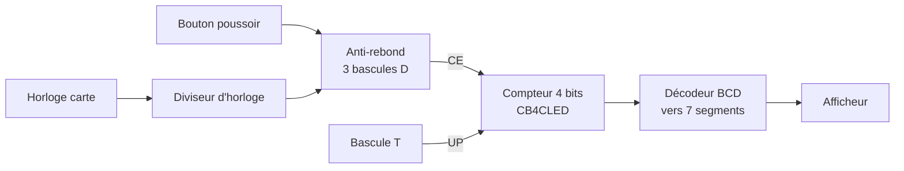
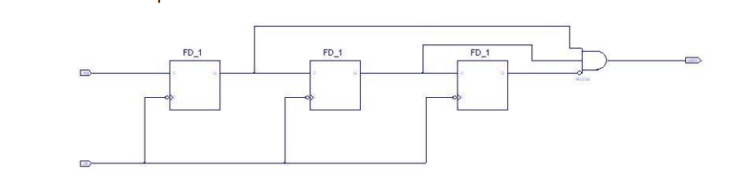
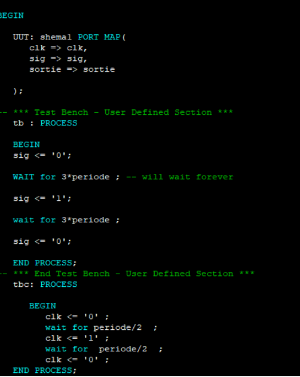
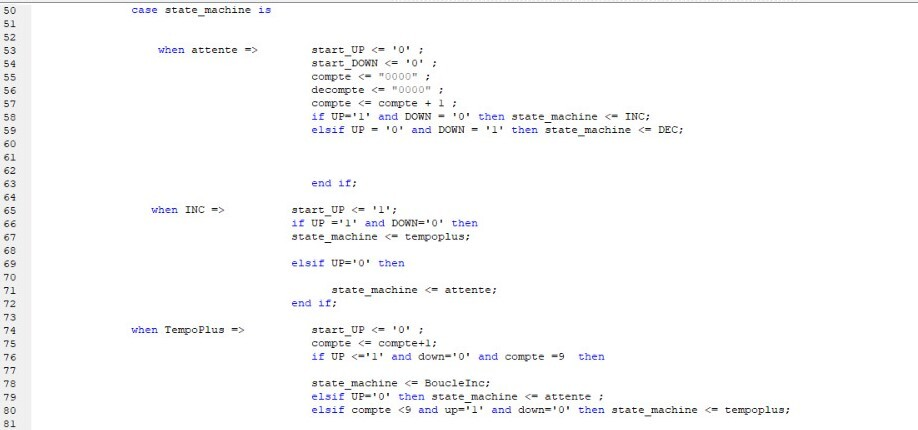
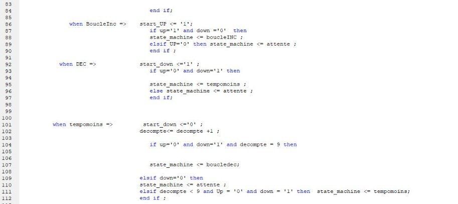
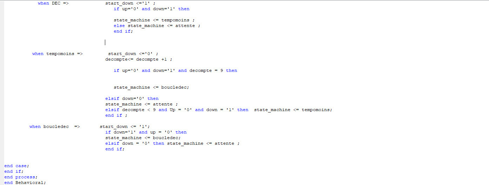

# Électronique numérique sur FPGA en VHDL

Travaux pratiques de conception numérique sur FPGA : un compteur/décompteur à bouton poussoir avec affichage 7 segments, puis l'affichage de la fréquence d'un tuner FM piloté par deux boutons, avec appui court et appui long gérés par une machine d'états temporisée.


*Machine d'états principale (STMP) du tuner : attente, incrément ou décrément unitaire, temporisation, puis défilement continu.*

## Sommaire

1. [Présentation](#présentation)
2. [Outils](#outils)
3. [TP 0 — Compteur avec anti-rebond et afficheur 7 segments](#tp-0--compteur-avec-anti-rebond-et-afficheur-7-segments)
4. [TP 2 — Affichage de la fréquence d'un tuner FM](#tp-2--affichage-de-la-fréquence-dun-tuner-fm)
5. [Simulation et implémentation](#simulation-et-implémentation)
6. [Contenu du dépôt et limites](#contenu-du-dépôt-et-limites)

## Présentation

- **Cadre** : travaux pratiques d'électronique numérique, cycle ingénieur Instrumentation, Sup Galilée (Université Sorbonne Paris Nord).
- **Objectif** : décrire des fonctions logiques combinatoires et séquentielles en schéma et en VHDL, les simuler, puis les implémenter sur une carte FPGA.
- **État** : travaux terminés, non maintenus.

## Outils

| Élément | Détail |
|---|---|
| Environnement | Xilinx ISE 14.7 |
| Description | Saisie de schéma et VHDL |
| Simulation | Bancs de test VHDL et chronogrammes |
| Carte | Carte FPGA de TP : boutons poussoirs `SW_USER0`, `SW_USER1`, `TEST_BUTTON` et quatre afficheurs 7 segments |

## TP 0 — Compteur avec anti-rebond et afficheur 7 segments

But : compter, décompter et afficher le nombre d'impulsions délivrées par un bouton poussoir.



| Bloc | Réalisation | Rôle |
|---|---|---|
| Anti-rebond | Schéma : 3 bascules D et une porte logique | La sortie ne change que si l'entrée reste stable pendant 3 fronts d'horloge |
| Diviseur d'horloge | VHDL : compteur `clock_scale` de 0 à 9 et comparaison à 5 | Génère une horloge lente de rapport cyclique 50 % |
| Décodeur BCD vers 7 segments | VHDL, logique combinatoire | Convertit 4 bits en 7 commandes de segments |
| Compteur 4 bits | Symbole `CB4CLED` | Compte ou décompte selon l'entrée `UP`, validé par `CE` |
| Bascule T | Schéma | Mémorise le sens de comptage |



*Anti-rebond : trois bascules D en cascade, cadencées par la même horloge.*

Contrainte retenue pour la simulation : la période du signal d'entrée doit être supérieure à 3 périodes d'horloge, sinon l'appui est filtré.



*Extrait du banc de test : génération de l'horloge et d'une impulsion d'entrée de 3 périodes.*

## TP 2 — Affichage de la fréquence d'un tuner FM

### Cahier des charges

| Exigence | Valeur |
|---|---|
| Plage de fréquence | 87,5 MHz à 108 MHz |
| Pas | 0,1 MHz |
| Affichage | 4 afficheurs 7 segments |
| Appui court (< 2 s) | Un seul pas (réglage fin) |
| Appui long (> 2 s) | Défilement continu jusqu'au relâchement (réglage rapide) |
| Butées | Le bouton d'incrément est inhibé à 108 MHz, celui de décrément à 87,5 MHz |
| Deux boutons pendant plus de 2 s | Retour à 87,5 MHz |
| Mise sous tension | Affichage de 87,5 MHz |

### Architecture

Deux machines d'états sont utilisées : `STINIT` pour le retour à la fréquence de départ, et `STMP`, la machine principale, qui transforme les appuis en ordres de comptage pour le compteur BCD.

### Machine d'états STMP

| État | Sorties | Transition |
|---|---|---|
| `attente` | `start_UP = 0`, `start_DOWN = 0`, compteurs de temporisation remis à zéro | Vers `INC` si UP seul, vers `DEC` si DOWN seul |
| `INC` | `start_UP = 1` (un pas) | Vers `TempoPlus` si le bouton reste appuyé, sinon `attente` |
| `TempoPlus` | `compte = compte + 1` | Vers `BoucleInc` quand `compte = 9`, vers `attente` au relâchement |
| `BoucleInc` | `start_UP = 1` maintenu (défilement) | Vers `attente` au relâchement |
| `DEC`, `TempoMoins`, `BoucleDec` | Symétriques pour le décrément | Symétriques |

Extraits du code VHDL de la machine d'états (captures issues du compte rendu) :





L'algorigramme du process du module « Compteur BCD » est disponible dans [`assets/algorigramme_compteur_bcd.jpg`](assets/algorigramme_compteur_bcd.jpg).

## Simulation et implémentation

- Chaque bloc est simulé avec un banc de test avant intégration ; la simulation sert à vérifier l'enchaînement temporel des signaux sur chronogramme.
- Le fichier de contraintes relie les entrées du circuit aux boutons de la carte et les sorties aux afficheurs.
- Le code écrit pour la simulation (stimuli, attentes temporelles) est distinct du code synthétisable implémenté sur la carte.

## Contenu du dépôt et limites

```
assets/    Diagrammes, schéma et captures du code VHDL
```

- **Sources absentes** : les fichiers du projet ISE (`.vhd`, `.sch`, `.ucf`) n'ont pas été conservés. Le dépôt documente le travail à partir du compte rendu ; le code n'apparaît que sous forme de captures.
- **Résultats** : aucune mesure sur carte ni chronogramme complet n'est disponible ici.
- **Référence de la carte** : non précisée dans les documents conservés.

## Auteure

Tedj El Moulk Sinacer
